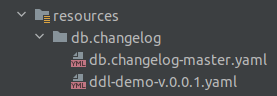

# User management

It is a very simple application that will allow us to present the features that Spring Boot 3.1 offers regarding Docker and TestContainers.

As a next step, I will create a two-rest endpoint like below,

Step 01: Create a User entity

```java
@Entity
@Table(name = "user", schema = "demo")
public class User {

    @Id
    @GeneratedValue
    private Long id;
    private String firstName;
    private String lastName;
    private String email;

    public User() {
    }

    public User(String firstName, String lastName, String email) {
        this.firstName = firstName;
        this.lastName = lastName;
        this.email = email;
    }

    // Getters and Setters
}
```

Step 02: Create a UserRepository by extending JpaRepository interface

```java
@Repository
public interface UserRepository extends JpaRepository<User, Long> {
}
```

Step 03: Create ddl database with liquibase in resources/db/changelog directory



Step 04: Create a UserService to define the createUser and getAllUsers methods

```java
@Service
public class UserService {

    private final UserRepository userRepository;

    public UserService(UserRepository userRepository) {
        this.userRepository = userRepository;
    }

    public User createUser(User user) {
        return userRepository.save(user);
    }

    public List<User> getAllUsers() {
        return userRepository.findAll();
    }
}
```

Step 05: Create UserController for defined a two endpoint

```java
@RestController
@RequestMapping("/api/users")
public class UserController {

    private final UserService userService;

    public UserController(UserService userService) {
        this.userService = userService;
    }

    @PostMapping(produces = MediaType.APPLICATION_JSON_VALUE)
    public ResponseEntity<User> createUser(@RequestBody User user) {
        return new ResponseEntity<User>(userService.createUser(user), HttpStatus.CREATED);
    }

    @GetMapping(produces = MediaType.APPLICATION_JSON_VALUE)
    public ResponseEntity<List<User>> getAllUsers() {
        var users = userService.getAllUsers();
        return ResponseEntity.ok(users);
    }
}
```

Step 06: Declare Spring boot app configuration in application.properties

```properties
# postgresql
spring.datasource.url= jdbc:postgresql://${POSTGRES_HOST:localhost}:${POSTGRES_PORT:5432}/${POSTGRES_DB:postgres}
spring.datasource.username= ${POSTGRES_USER:postgres}
spring.datasource.password= ${POSTGRES_PASSWORD:postgres123}
spring.datasource.jpa.database-platform= org.hibernate.dialect.PostgreSQL9Dialect
## default connection pool
spring.datasource.hikari.connectionTimeout=20000
spring.datasource.hikari.initialization-fail-timeout= 0
```

In the maven modules "docker-compose" and "testcontainers" we present the respective features that Spring Boot 3.1 offers.
