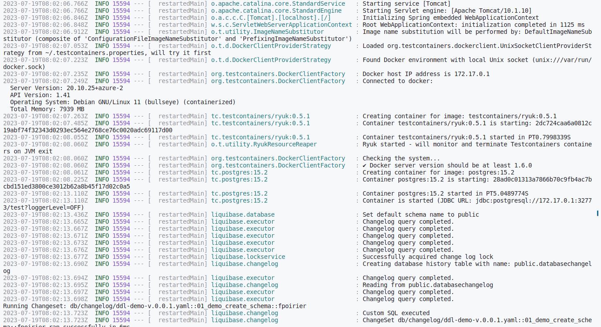
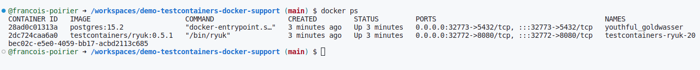

# Using Testcontainers in Tests

Let’s start with the standard usage example. The first repository has a single Spring Boot app that connects to the Postgresql database.
In order to build automated tests we have to include the following Maven dependencies:

```xml
<dependency>
  <groupId>org.springframework.boot</groupId>
  <artifactId>spring-boot-starter-test</artifactId>
  <scope>test</scope>
</dependency>
<dependency>
  <groupId>org.testcontainers</groupId>
  <artifactId>junit-jupiter</artifactId>
  <version>${testcontainers.version}</version>
  <scope>test</scope>
</dependency>
<dependency>
  <groupId>org.testcontainers</groupId>
  <artifactId>postgresql</artifactId>
  <version>${testcontainers.version}</version>
  <scope>test</scope>
</dependency>
```
Now, we can create the tests. We need to annotate our test class with @Testcontainers.
Then, we have to declare the PostgreSQLContainer bean. Before Spring Boot 3.1, we would have to use DynamicPropertyRegistry to set the PostgreSQL address automatically generated by Testcontainers.

```java
@SpringJUnitConfig(classes = {Application.class})
@Testcontainers
public class PostgresIntegrationTest {
  private static final Logger LOGGER = LoggerFactory.getLogger(PostgresIntegrationTest.class);

  @Container
  public static PostgreSQLContainer postgreSQLContainer = new PostgreSQLContainer("postgres:12")
      .withDatabaseName("integration-tests-db")
      .withUsername("sa")
      .withPassword("sa");
........................
........................

  @DynamicPropertySource
  static void postgresProperties(DynamicPropertyRegistry registry) {
       registry.add("spring.datasource.url", postgreSQLContainer::getJdbcUrl);
       registry.add("spring.datasource.username", postgreSQLContainer::getUsername);
       registry.add("spring.datasource.password", postgreSQLContainer::getPassword);
  }
........................
........................
```

Fortunately, beginning from Spring Boot 3.1 we can simplify that notation with <span style="color:red">@ServiceConnection</span> annotation.
Here’s the full test implementation with the latest approach. It verifies some REST endpoints exposed by the app.

```java
@TestConfiguration(proxyBeanMethods = false)
public class TestContainersConfiguration {

    @Bean
    @ServiceConnection
    @RestartScope
    public PostgreSQLContainer  postgreSQLContainer() {
        return new PostgreSQLContainer("postgres:15.2");
    }
}

@SpringBootTest(webEnvironment = SpringBootTest.WebEnvironment.RANDOM_PORT)
@Import(TestContainersConfiguration.class)
@ActiveProfiles("test")
public class BaseIntegrationTest {

    @Autowired
    protected TestRestTemplate testRestTemplate;

    @Autowired
    protected UserRepository userRepository;

    @AfterEach
    void cleanup() {
        userRepository.deleteAll();
    }
}

public class UserControllerE2ETest extends BaseIntegrationTest {

    @Test
    void shouldReturnSavedUser() {
        // given
        JSONObject userDetailsRequestJson = new JSONObject();
        userDetailsRequestJson.put("firstName","John");
        userDetailsRequestJson.put("lastName","Wick");
        userDetailsRequestJson.put("email","john.wick@gmail.com");
        HttpHeaders headers = new HttpHeaders();
        headers.setContentType(MediaType.APPLICATION_JSON);
        headers.setAccept(Arrays.asList(MediaType.APPLICATION_JSON));
        HttpEntity<String> request =
                new HttpEntity<String>(userDetailsRequestJson.toString(), headers);

        // when
        ResponseEntity<User> createdUserDetailsEntity = testRestTemplate.postForEntity("/api/users", request, User.class);

        // then
        assertEquals(HttpStatus.CREATED, createdUserDetailsEntity.getStatusCode());
        assertNotNull(createdUserDetailsEntity.getBody());
    }
}
```
Now, we can build the project with the standard Maven command.
Then Testcontainers will automatically start the Postgresql database before the test. Of course, we need to have Docker running on our machine.

```command
mvn clean package
```
Tests run fine. But what will happen if we would like to run our app locally for development? We can do it by running the app main class directly from IDE or with the mvn spring-boot:run Maven command.
Of course, unless we start the Postgresql database our app won’t be able to connect it. If we use Docker, we first need to execute the docker run command that runs Postgresql and exposes it on the local port.

# Use Testcontainers in Development Mode with Spring Boot
Fortunately, with Spring Boot 3.1 we can simplify that process. We don’t have to Postgresql before starting the app.
What we need to do – is to enable development mode with Testcontainers. Firstly, we should include the following Maven dependency in the test scope:

```xml
<dependency>
  <groupId>org.springframework.boot</groupId>
  <artifactId>spring-boot-testcontainers</artifactId>
</dependency>
```

Then we need to prepare the @TestConfiguration class with the definition of containers we want to start together with the app.
For me, it is just a single Postgresql container as shown below:

```java
@TestConfiguration(proxyBeanMethods = false)
public class TestContainersConfiguration {

    @Bean
    @ServiceConnection
    @RestartScope
    public PostgreSQLContainer  postgreSQLContainer() {
        return new PostgreSQLContainer("postgres:15.2");
    }
}
```

After that, we have to “override” the Spring Boot main class. It should have the same name as the main class with the Test suffix. Then we pass the current main method inside the SpringApplication.from(...) method. We also need to set @TestConfiguration class using the with(...) method.

```java
public class ApplicationTest {

    public static void main(String[] args) {
        SpringApplication.from(Application::main)
                .with(TestContainersConfiguration.class)
                .run(args);
    }
}
```

Finally, we can start our “test” main class directly from the IDE or we can just execute the following Maven commands in root directory:
```command
mvn clean install
cd testcontainers
mvn spring-boot:test-run
```
Once the app starts you will see that the Postgresql container is up and running and connection to it is established.



Since we are in dev mode we will also include the Spring Devtools module to automatically restart the app after the source code change.
```xml
<dependency>
  <groupId>org.springframework.boot</groupId>
  <artifactId>spring-boot-devtools</artifactId>
  <optional>true</optional>
</dependency>
```
Let’s what happened. Once we provide a change in the source code Spring Devtools will restart the app and the Postgresql container. You can verify it in the app logs and also on the list of running Docker containers. As you see the Testcontainer ryuk has been initially started a minute ago, while Postgresql was restarted after the app restarted X seconds ago.



In order to prevent restarting the container on app restart with Devtools we need to annotate the <span style="color:red">PostgreSQLContainer</span> bean with <span style="color:red">@RestartScope</span>.

```java
@TestConfiguration(proxyBeanMethods = false)
public class TestContainersConfiguration {

    @Bean
    @ServiceConnection
    @RestartScope
    public PostgreSQLContainer  postgreSQLContainer() {
        return new PostgreSQLContainer("postgres:15.2");
    }
}
```
Now, Devtools just restart the app without restarting the container.
